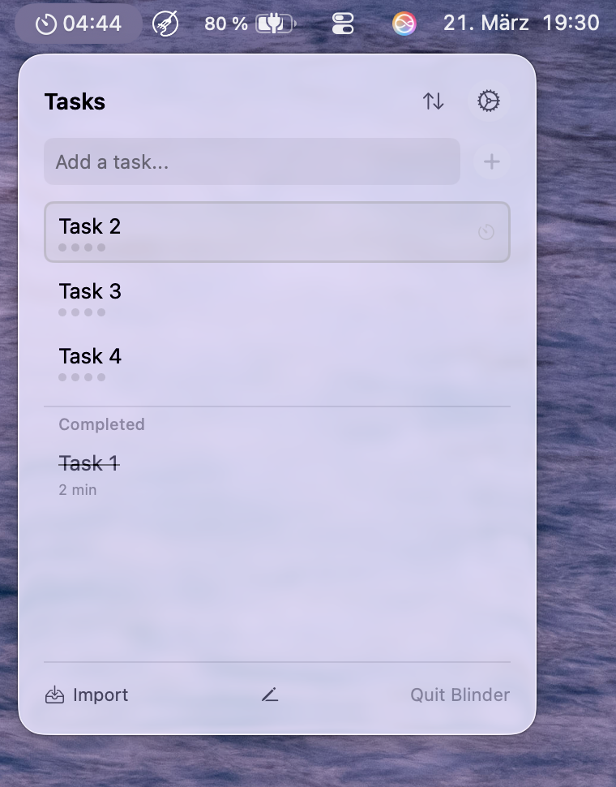
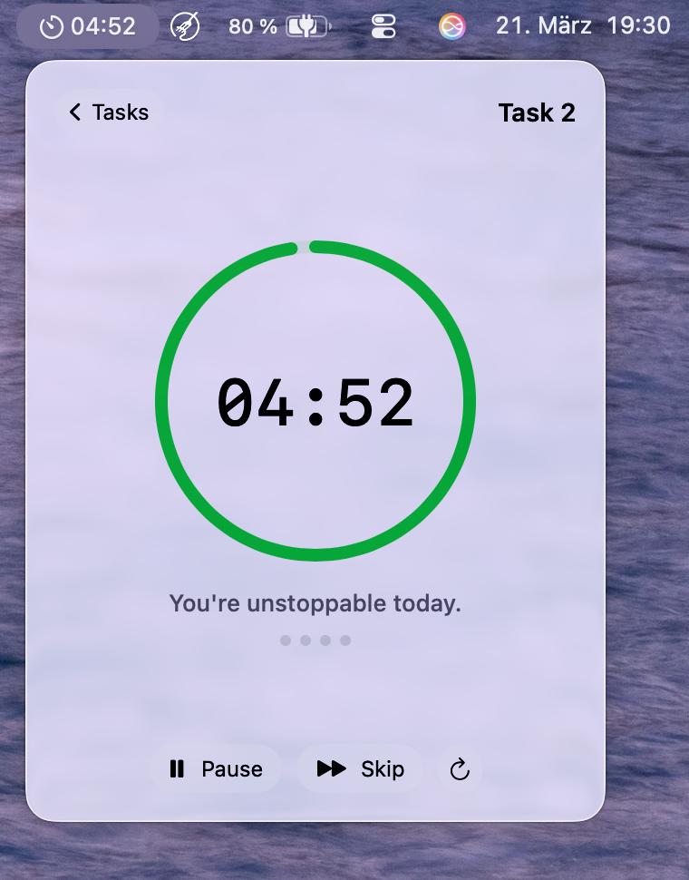
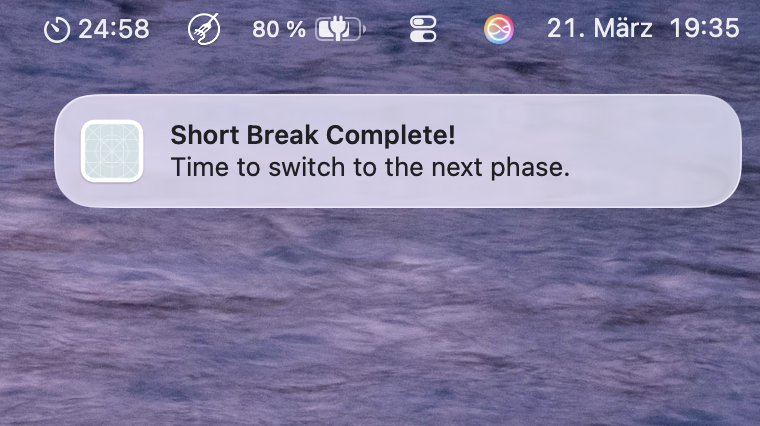
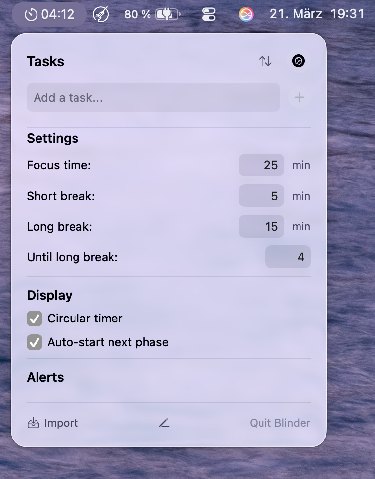
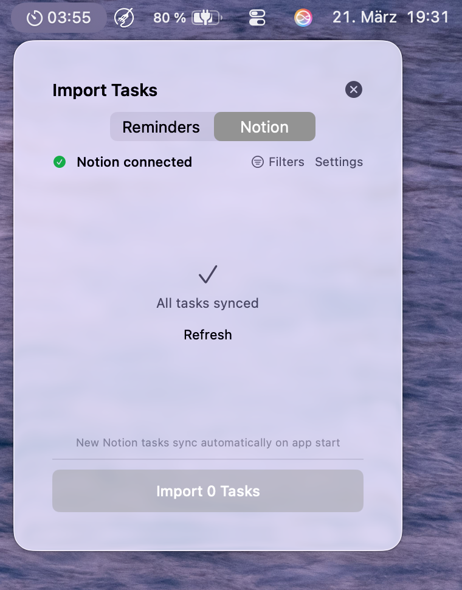

# Blinder

A minimal Pomodoro timer for your Mac menu bar. Focus on your tasks with timed work sessions, short breaks, and long breaks — all without leaving your workflow.

## Features

- **Menu Bar Timer** — Always visible countdown in your menu bar
- **Pomodoro Cycles** — Work → Short Break → Work → ... → Long Break, automatically
- **Auto-Start** — Optionally start the next phase automatically to stay in flow
- **Notion Sync** — Import tasks from your Notion database and sync completion status
- **Reminders & Notes Import** — Pull tasks from Apple Reminders or Notes
- **Notifications** — Get notified when a phase ends (configurable per phase)
- **Circular Timer** — Optional analog clock display
- **Cycle Tracking** — See completed cycles (1×, 2×, 3×...) and work time per task

## Screenshots

| Timer | Notification | Task List |
|-------|-------------|-----------|
|  |  |  |

| Settings | Notion Sync |
|----------|-------------|
|  |  |

## Installation

1. Download the latest `.dmg` from [Releases](https://github.com/jakseg/Blinder-Releases/releases)
2. Open the `.dmg` and drag **Blinder** to your Applications folder
3. Launch Blinder — it appears in your menu bar as a timer icon

> **Note:** On first launch, macOS may show a security warning. Go to **System Settings → Privacy & Security** and click "Open Anyway".

## Usage

### Basic Workflow

1. Add tasks or import them from Notion/Reminders
2. Click a task to start the Pomodoro timer
3. Work for 25 minutes (default), then take a 5-minute break
4. After 4 work sessions, take a longer 15-minute break
5. Repeat — the cycle counter shows your progress (1×, 2×, 3×...)

### Settings

Open settings via the gear icon in the task list:

| Setting | Default | Description |
|---------|---------|-------------|
| Focus time | 25 min | Duration of a work session |
| Short break | 5 min | Break between work sessions |
| Long break | 15 min | Break after a full cycle |
| Until long break | 4 | Work sessions before a long break |
| Circular timer | Off | Show an analog clock instead of digits |
| Auto-start next phase | On | Automatically start the next phase |

### Notifications

Enable alerts in Settings to get notified when a phase ends. You can configure notifications independently for:

- Focus time complete
- Short break complete
- Long break complete

Sound can be toggled separately from visual alerts.

> **Important:** Make sure to allow notifications for Blinder in **System Settings → Notifications → Blinder**. Without this, notifications won't appear even if enabled in the app.

### Notion Integration

Connect your Notion database to import and sync tasks:

1. Create a [Notion Integration](https://www.notion.so/my-integrations) and copy the API key
2. Share your database with the integration (click "..." on the database → "Connections" → add your integration)
3. Copy your database ID from the URL: `notion.so/your-workspace/DATABASE_ID?v=...`
4. In Blinder, go to **Import → Notion** and paste your API key and database ID
5. Click **Connect & Load Tasks**

**Features:**
- Tasks sync automatically on app start
- Completion status syncs back to Notion (requires a "Status" property)
- Filter which tasks to import (by status, tags, etc.)
- Blinder auto-detects your "Done" and "Not Started" status values

### Keyboard Shortcuts

| Shortcut | Action |
|----------|--------|
| `Space` | Start / Pause timer |
| `⌘Q` | Quit Blinder |

## Privacy

- All data stays on your Mac (local SwiftData database)
- No analytics, no tracking, no telemetry
- Notion API key is stored locally in UserDefaults — never shared with anyone except Notion's API (`https://api.notion.com`) over HTTPS
- No other network connections

## Requirements

- macOS 26 (Tahoe) or later

## License

Blinder is free to use. All rights reserved — the source code is not included in this distribution.
